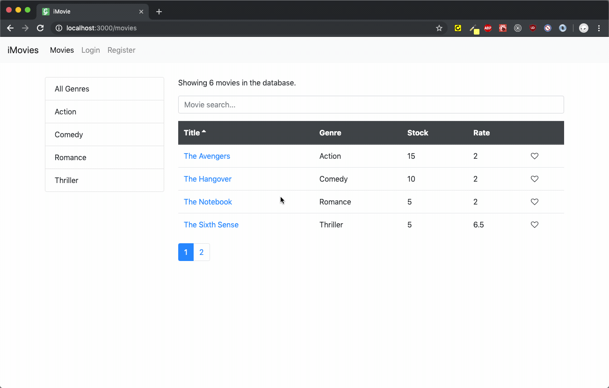

## iMovies

iMovies is a production-ready react app for the movie store.

### `Installation`

Clone over https:

```
$ git clone https://github.com/Nejo12/iMovies.git
```

Clone over ssh:

```
$ git clone git@github.com:Nejo12/iMovies.git
```

Use the node package manager [npm](https://www.npmjs.com/) to initialize and install dependencies.

Install

```
npm install
```

Run

```
npm start
```

View and enjoy the functionality :cool: .

### `Running the app`

Movie title with its individual genre, stock, rate and likes can be viewed on the home page without registration. Adding, editing, and likes on any movie can also be done by all users, deleting any movie is, however, restricted to admin.

### `Tech stack`

- bootstrap
- fontawesome
- schema (form validation with Joi)
- axios
- Lodash
- Toastify

### `Demo`


